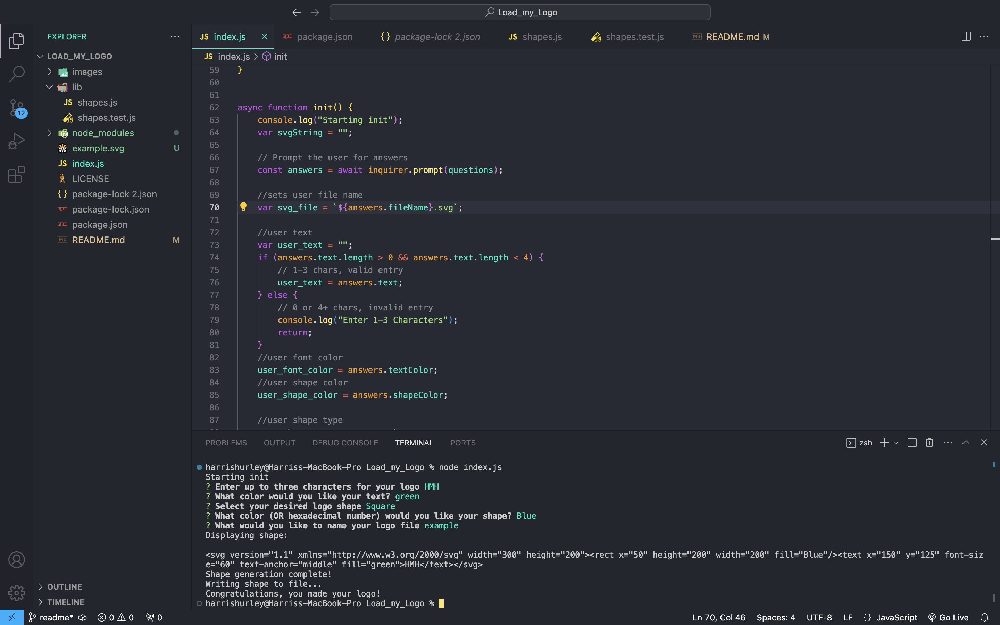
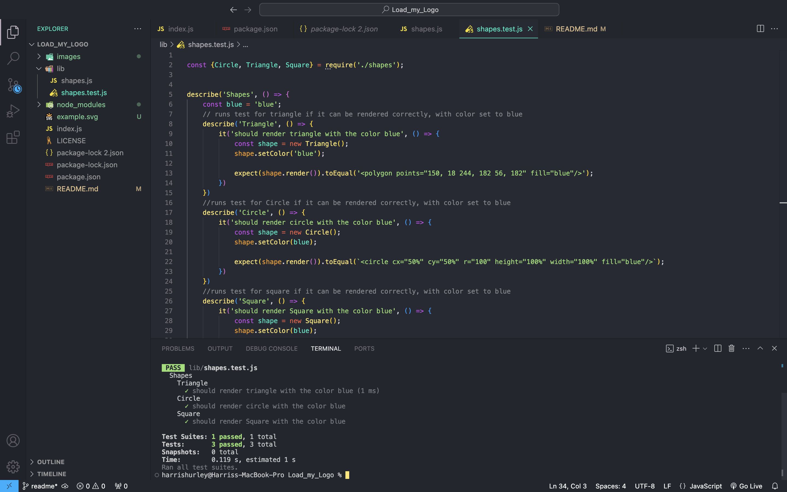

# Load_my_Logo
    

## Description

The Logo Generator CLI is a powerful command-line tool designed to simplify the process of creating custom logos for various purposes. Whether you're a designer needing quick logo prototypes, a developer integrating logo generation into your applications, or a business owner looking to brand your products, this CLI tool provides a seamless and intuitive solution.

## Deployed Application URL
N/A

## Table of Contents
* [Installation](#installation)
* [Usage](#usage)
* [Credits](#credits)
* [Features](#features)
* [Dependencies](#dependencies)
* [Screenshots](#screenshots)
* [Walkthrough](#walkthrough)
* [How to Contribute](#how-to-contribute)
* [Tests](#tests)
* [License](#license)
* [Screenshots](#screenshots)

## Installation
1. run 'npm init -y'
2. install inquirer from node 'npm i inquirer@8.2.4'
3. install jest from node 'npm i jest@29.7.0'

## Usage
To use this application, follow these steps:

1. Install dependencies: Run npm install to install the required dependencies.
2. Run the CLI: Execute node index.js to start the Logo Generator CLI.
3. Follow the prompts: Answer the prompts to input text, select colors, choose a shape, and specify the file name for your logo.
4. Logo generation: Once all inputs are provided, the CLI will generate your logo and save it as an SVG file.

## Credits

N/A

## Features

- Text Input: Users can input up to three characters for the logo text, allowing for short and concise messaging.
- Color Customization: Choose the color of both the text and the logo shape using color keywords or hexadecimal values.
- Shape Selection: Select from three basic shapes for your logo: circle, square, or triangle.
- SVG Output: Logos are generated in SVG (Scalable Vector Graphics) format, ensuring high-quality and resizable graphics.
- File Export: Generated logos are saved as SVG files, making it easy to use them in various digital projects.

## Dependencies

inquirer 8.2.4
jest 29.7.0

## Screenshots

## Walkthrough
[Walkthrough Video](https://drive.google.com/file/d/1cgCD8MDkZQnpYQZ-d8vduxsLiDO9WSRp/view)

## How to Contribute
If you would like to contribute you can contact me [Via Email](mailto:harrismhurley@icloud.com?subject=[GitHub]%20Dev%20Connect) or visit [github](https://github.com/harrismhurley).

## Tests

The Logo Generator CLI includes a suite of tests to ensure the correct rendering of shapes with various color options. The tests cover the rendering of circles, triangles, and squares with the specified colors.

To run the tests locally, follow these steps:

1. Navigate to the root directory of the project in your terminal.
2. Ensure that all dependencies are installed by running: 'npm install'
3. Run the test suite using the following command: 'npm test'

The test suite validates that each shape can be rendered correctly with the specified color. If all tests pass, you can be confident that the Logo Generator CLI functions as expected, generating logos with accurate shapes and colors.

## License 
This project is licensed under the [MIT](https://opensource.org/licenses/MIT) license.